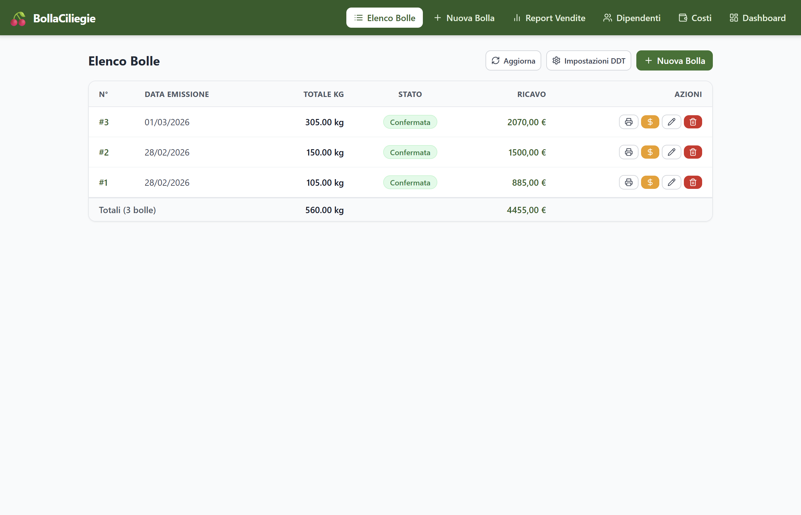
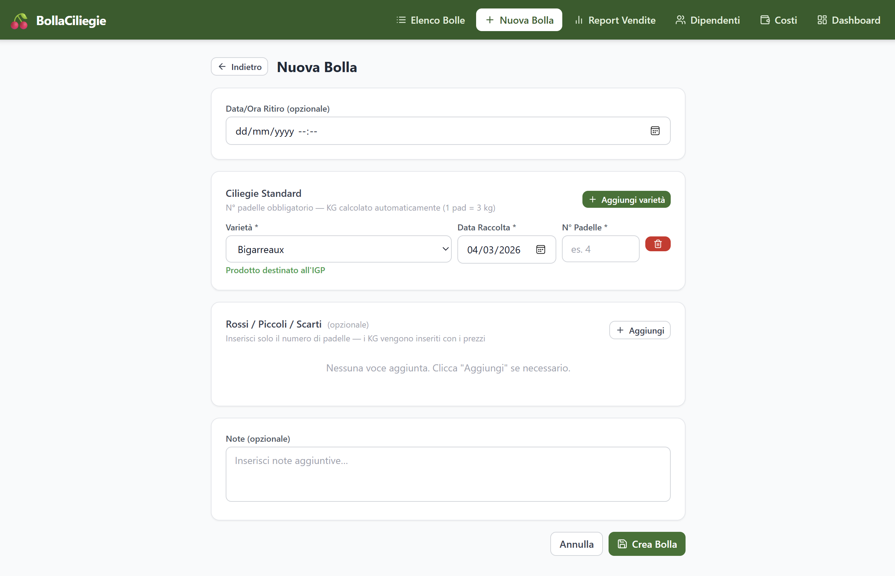
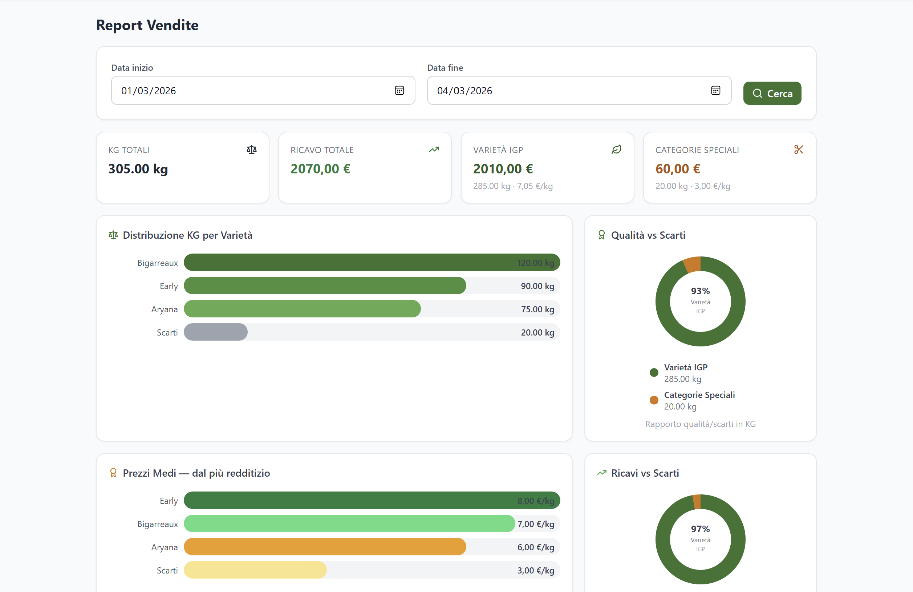
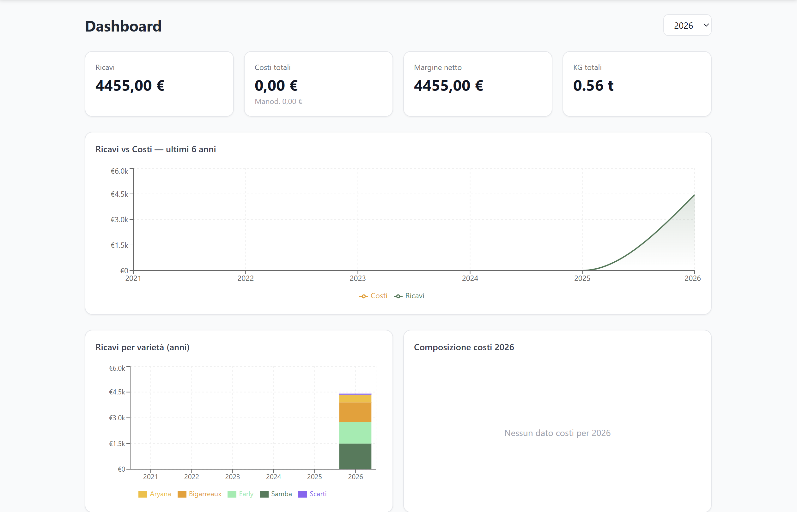
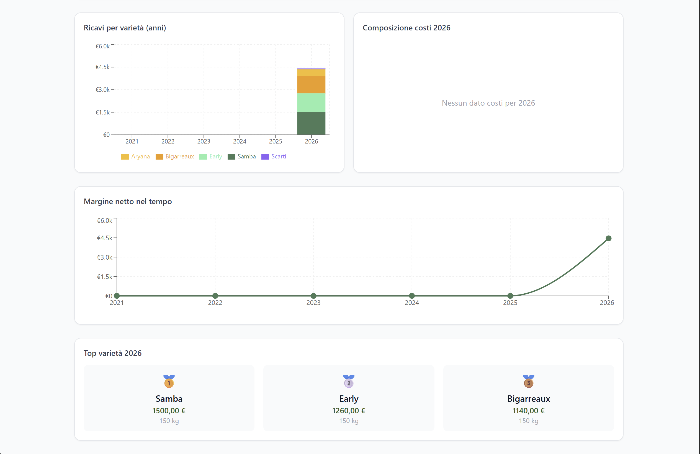

# BollaCiliegie

A desktop app for managing transport documents (DDT) in a cherry farming business. Built for a real client to replace a fully manual, paper-based workflow.

## Screenshots

| Bill List | New Bill |
|:---:|:---:|
|  |  |

| Sales Report | Dashboard |
|:---:|:---:|
|  |  |

<p align="center">
  
</p>

## What it does

- **Create transport bills** — select cherry variety, number of crates (kg calculated automatically), harvest date and pickup time
- **Print DDT** — generates a ready-to-print transport document (HTML → PDF), no external dependencies
- **Set prices** — enter the price per kg after delivery to close the bill
- **Sales report** — total kg, revenue and average price per variety, filtered by date range, with charts
- **Employee & cost management** — track labour costs and operating expenses per season
- **Analytics dashboard** — seasonal KPIs (revenue, costs, net margin, total kg), historical charts, top varieties by revenue
- **Three bill states**: `Not Printed` → `Pending` → `Confirmed`

## Tech stack

| Layer | Technology |
|---|---|
| UI | React 18 + Vite |
| Styling | Tailwind CSS 3 |
| Desktop | Tauri 2 (WebView2) |
| Database | SQLite (rusqlite, bundled) |
| Backend | Rust |

## Run locally

```bash
git clone https://github.com/simopan12/Bolla_Ciliegie_React.git
cd Bolla_Ciliegie_React
npm install
npm run tauri dev
```

> **Windows note**: if `cargo` is not in your PATH, run this first:
> ```bash
> export PATH="$HOME/.cargo/bin:$PATH"
> ```

**Requirements:** Node.js ≥ 18, Rust (via [rustup](https://rustup.rs/)), Visual Studio C++ Build Tools

## Build

```bash
npm run tauri build
```

The `.exe` installer is generated in `src-tauri/target/release/bundle/`.
